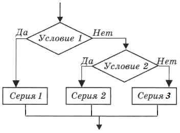

# Ветвления
* полное (`if ...`)
* неполное (`if ... else ...`)
* множественное (`if ... elif ... else ...`)

## Неполное ветвление

Необходимо запросить имя пользователя и вывести сообщение `Рад знакомству!` Если пользователя зовут Миша, вывести _дополнительное_ сообщение `Мы тёзки!`  
Ниже представлено два примера работы одной программы

Пример 1
> Как Вас зовут: _Петя_  
> Рад знакомству! 

Пример 2
> Как Вас зовут: _Миша_  
> Мы тёзки!  
> Рад знакомству!

&nbsp;

Для вывода дополнительного сообщения `Мы тёзки!` используется неполное ветвление 


```Python
name = input('Как Вас зовут: ')

if name == 'Миша':
    print('Мы тёзки!')

print('Рад знакомству!')
```

## Полное ветвление

Необходимо предложить пользователю угадать имя. Если пользователь ввёл `Миша`, вывести сообщение `Угадал!` При вводе любого другого значения вывести сообщение `Не угадал!`

Пример 1 
> Угадай, как меня зовут: _Миша_  
> Угадал!  

Пример 2 
> Угадай, как меня зовут: _Федя_  
> Не угадал!  


```Python
answer = input('Угадай, как меня зовут: ')

if answer == 'Миша':
    print('Угадал!')
else:
    print('Не угадал!')
```

## Множественное (каскадное) ветвление

Пользователю предлагается угадать загаданное число. Возможны три варианта:

1. число угадано
2. введенное число больше загаданного
3. введенное число меньше загаданного

Необходимо вывести соответствующие сообщения во всех трёх случаях

Пример 1 
> Я загадал число от 1 до 10!  
> Угадай его: _7_  
> Угадал!  

Пример 2
> Я загадал число от 1 до 10!  
> Угадай его: _5_  
> Моё число больше!

Пример 3
> Я загадал число от 1 до 10!  
> Угадай его: _10_  
> Моё число меньше!



```Python

secret_num = 7
print("Я загадал число от 1 до 10!")
answer = int(input('Угадай его: '))
```
Далее необходимо проверить ответ пользователя и вывести одно (только одно!) сообщение из трёх возможных.  
Рассмотрите следующий вариант записи ветвления:

```python
if secret_num == answer:
    print('Угадал!')
else:
    if secret_num > answer:
        print('Моё число больше!')
    else:
        print('Моё число меньше!')
```

В первом блоке `else` содержится конструкция `if ... else ...`  
Python позволяет нам использовать ключевое слово `elif` вместо `else: if` и писать все блоки на одном уровне. Так код легче читается:

```python
if secret_num == answer:
    print('Угадал!')
elif secret_num > answer:
    print('Моё число больше!')
else:
    print('Моё число меньше!')
```
